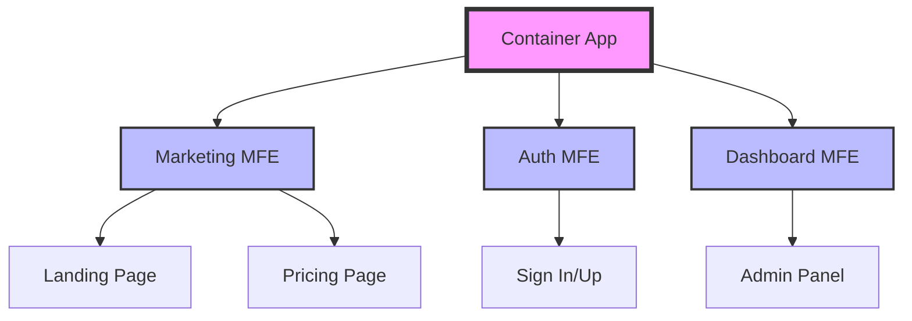
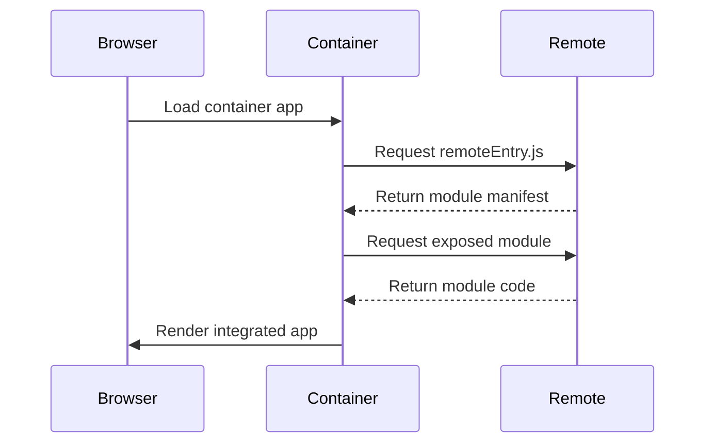
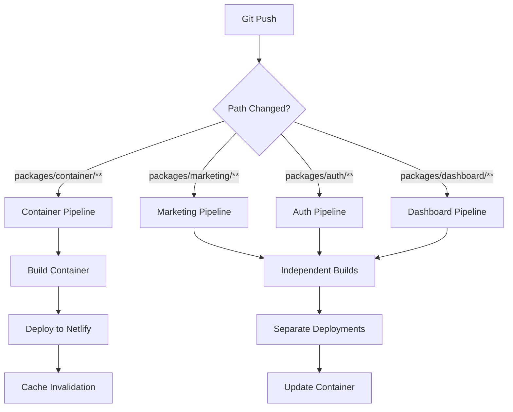
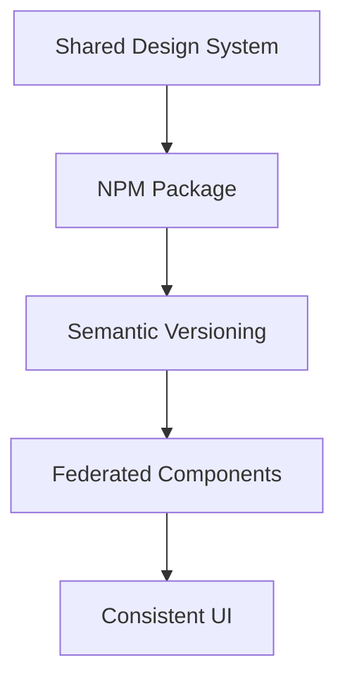

# Enterprise Micro Frontend Architecture

## Overview

This proof-of-concept (POC) repository demonstrates how enterprises can structure frontend systems for scalability and independent team ownership using micro frontends. Born from the challenges of managing large-scale web applications, this architecture addresses the growing complexity in enterprise frontend development.

## Table of Contents

1. [Why Micro Frontends?](#why-micro-frontends)
2. [Monolithic SPA vs. Micro Frontend Architecture](#monolithic-spa-vs-micro-frontend-architecture)
3. [Architectural Overview](#architectural-overview)
4. [Repository Structure](#repository-structure)
   - [Package Responsibilities](#package-responsibilities)
   - [Shared Contracts](#shared-contracts)
   - [Dependency Isolation](#dependency-isolation)
5. [Technical Implementation](#technical-implementation)
   - [Module Federation: Runtime Integration](#module-federation-runtime-integration)
   - [Module Federation Configuration](#module-federation-configuration)
   - [Routing Strategy](#routing-strategy)
6. [Development Setup](#development-setup)
   - [Prerequisites](#prerequisites)
   - [Quick Start](#quick-start)
   - [Individual Service Ports](#individual-service-ports)
   - [Local Federation Flow](#local-federation-flow)
   - [Environment Configuration](#environment-configuration)
   - [Troubleshooting](#troubleshooting)
7. [Production Deployment](#production-deployment)
   - [CI/CD Architecture](#cicd-architecture)
   - [Independent Deployment Workflows](#independent-deployment-workflows)
   - [Deployment Strategy](#deployment-strategy)
   - [Production URLs](#production-urls)
   - [Deployment Considerations](#deployment-considerations)
8. [Common Issues & Solutions](#common-issues--solutions)
9. [Future Improvements](#future-improvements)
10. [Contributing](#contributing)
11. [License](#license)
12. [Acknowledgments](#acknowledgments)

---

### Why Micro Frontends?

Traditional monolithic Single Page Applications (SPAs) become bottlenecks as organizations scale. Teams face deployment conflicts, tight coupling, and coordination overhead. Micro frontends solve these challenges by enabling:

- Autonomous teams working independently without stepping on each other's toes
- Parallel development and deployment cycles reducing time-to-market
- Technology flexibility allowing teams to choose optimal tools for their domain
- Incremental upgrades of large applications without full rewrites

### Monolithic SPA vs. Micro Frontend Architecture

| Aspect | Monolithic SPA | Micro Frontend |
|--------|----------------|----------------|
| Deployment | All or nothing | Independent per feature |
| Team Autonomy | Tight coupling | Full ownership |
| Technology Choice | Fixed stack | Flexible per domain |
| Scaling Development | Linear/bottlenecked | Parallel/autonomous |

### Architectural Overview



Key architectural benefits:
- 🏗️ **Independent Deployability**: Each micro frontend builds and deploys autonomously
- 🔄 **Runtime Integration**: Dynamic loading via Module Federation
- 🛠️ **Framework Flexibility**: Demonstrates React and Vue integration
- 🚀 **Automated Pipeline**: Independent CI/CD workflows per application
- 📦 **Isolated Development**: Each team can work independently

## Repository Structure

Each package in this monorepo represents an independently deployable micro frontend with its own build configuration, dependencies, and deployment pipeline.

```
packages/
├── container/          # Shell application (React)
│   ├── config/        # Webpack + Module Federation config
│   ├── public/        # Static assets + _redirects
│   └── src/          # Orchestration + routing logic
│
├── marketing/         # Public-facing pages (React)
│   ├── config/       # Independent webpack setup
│   ├── public/       # Static + routing config
│   └── src/         # Landing, pricing pages
│
├── auth/             # Authentication flows (React)
│   ├── config/       # Webpack configuration
│   ├── public/       # Static assets
│   └── src/         # Sign-in/sign-up flows
│
└── dashboard/        # Admin dashboard (Vue)
    ├── config/       # Vue-specific webpack
    ├── public/       # Static assets
    └── src/         # Dashboard components
```

### Package Responsibilities

- **Container**: Acts as the shell application orchestrating routing, managing shared dependencies, and handling runtime integration of remote apps. It's the only package aware of other micro frontends.

- **Marketing**: Manages public-facing content including landing page and pricing. Operates independently for content updates without impacting other services.

- **Auth**: Handles user authentication flows, session management, and security. Can be updated independently for security patches.

- **Dashboard**: Demonstrates framework flexibility by using Vue.js. Shows how different teams can choose optimal tools for their domain.

### Shared Contracts

1. **Dependencies**: 
   - React/Vue versions managed via Module Federation shared config
   - Common utilities (routing, state management) exposed via container

2. **Integration Contract**:
   - Each remote must expose a mount function
   - Must use MemoryRouter when integrated
   - Must emit navigation events to container

### Dependency Isolation

Each package maintains its own:
- `package.json` with independent versioning
- Webpack configuration for custom build needs
- CI/CD pipeline for autonomous deployment
- Development server for isolated testing

## Technical Implementation

### Module Federation: Runtime Integration

Webpack 5's Module Federation enables runtime code sharing between applications. Unlike traditional build-time integration or iframe-based solutions, it allows:

- Dynamic loading of remote modules at runtime
- Shared dependency management
- Near-native performance with zero double-bundle loading

#### Runtime Integration Flow



### Module Federation Configuration

Each micro frontend exposes its entry point:

```javascript
// marketing/config/webpack.prod.js
{
  output: {
    filename: '[name].[contenthash].js',
    publicPath: 'https://marketing-mfe.netlify.app/'
  },
  plugins: [
    new ModuleFederationPlugin({
      name: 'marketing',
      filename: 'remoteEntry.js',
      exposes: {
        './MarketingApp': './src/bootstrap'
      },
      shared: packageJson.dependencies
    })
  ]
}
```

Container app consumes remotes:

```javascript
// container/config/webpack.prod.js
{
  plugins: [
    new ModuleFederationPlugin({
      name: 'container',
      remotes: {
        marketing: `marketing@${MARKETING_DOMAIN}/remoteEntry.js`,
        auth: `auth@${AUTH_DOMAIN}/remoteEntry.js`,
        dashboard: `dashboard@${DASHBOARD_DOMAIN}/remoteEntry.js`
      },
      shared: packageJson.dependencies
    })
  ]
}
```

### Why Module Federation?

We chose Webpack Module Federation over alternatives for several reasons:

1. **Runtime Integration**: Unlike Nx or Turborepo which handle build-time composition, Module Federation enables true runtime integration.

2. **Shared Dependencies**: Sophisticated version resolution prevents duplicate React/Vue loads while allowing independent updates.

3. **Progressive Loading**: Remotes load only when needed, reducing initial bundle size.

4. **Framework Agnostic**: Seamlessly integrates React and Vue applications.

### Version Management

Module Federation handles shared dependency conflicts through:
- Semantic version matching (`shared: packageJson.dependencies`)
- Singleton enforcement for React/Vue
- Fallback versions if version mismatch occurs
```

### Routing Strategy

The application implements a hierarchical routing strategy that prevents conflicts while maintaining flexibility for standalone development.

#### Router Implementation

- **Container**: Uses `BrowserRouter` for top-level navigation
  ```javascript
  // container/src/App.js
  const App = () => (
    <BrowserRouter>
      <Route path="/auth/*" component={AuthApp} />
      <Route path="/dashboard/*" component={DashboardApp} />
    </BrowserRouter>
  );
  ```

- **Micro frontends**: Use `MemoryRouter` when integrated, `BrowserRouter` in standalone
  ```javascript
  // marketing/src/App.js
  const App = ({ history }) => (
    <MemoryRouter>
      <Switch>
        <Route exact path="/" component={Landing} />
        <Route path="/pricing" component={Pricing} />
      </Switch>
    </MemoryRouter>
  );
  ```

#### Navigation Events

Remote apps bubble up navigation events to the container:
```javascript
// marketing/src/bootstrap.js
onNavigate({ pathname: nextLocation }) {
  const { pathname } = history.location;
  if (pathname !== nextLocation) {
    history.push(nextLocation);
  }
}
```

#### Deep Linking Support

Netlify configuration handles SPA routing through `_redirects`:
```
/*    /index.html   200
```

This ensures proper handling of:
- Direct URL access to nested routes
- Browser refresh on any route
- Back/forward navigation

#### Trade-offs and Considerations

1. **History Synchronization**:
   - Memory router state can get out of sync with browser history
   - Solved by passing navigation callbacks from container

2. **Route Conflicts**:
   - Multiple remotes can't claim same route path
   - Container manages route prefixing (/auth/*, /dashboard/*)

3. **Development Mode**:
   - Each app needs different port to avoid conflicts
   - BrowserRouter in dev enables standalone testing

## Development Setup

### Prerequisites
- Node.js >= 14
- npm >= 6
- Ports 8080-8083 available

### Quick Start

```bash
# Clone repository
git clone https://github.com/DaEagle01/microfrontend.git

# Install dependencies (from root)
npm install
npm run bootstrap   # Install dependencies for all packages

# Start all services concurrently
npm run start      # Starts all micro frontends
```

### Individual Service Ports

| Service    | Port | Local URL                  |
|------------|------|----------------------------|
| Container  | 8080 | http://localhost:8080      |
| Marketing  | 8081 | http://localhost:8081      |
| Auth       | 8082 | http://localhost:8082      |
| Dashboard  | 8083 | http://localhost:8083      |

### Local Federation Flow

1. Container (`localhost:8080`) boots up
2. Requests remote entries from other services:
   ```javascript
   // container/webpack.dev.js
   remotes: {
     marketing: 'marketing@http://localhost:8081/remoteEntry.js',
     auth: 'auth@http://localhost:8082/remoteEntry.js',
     dashboard: 'dashboard@http://localhost:8083/remoteEntry.js'
   }
   ```
3. Each remote serves its `remoteEntry.js` locally
4. Container dynamically imports and renders remotes

### Environment Configuration

Required `.env` variables:
```bash
# .env.development
PORT=8080
MARKETING_URL=http://localhost:8081
AUTH_URL=http://localhost:8082
DASHBOARD_URL=http://localhost:8083

# .env.production
MARKETING_URL=https://marketing-mfe.netlify.app
AUTH_URL=https://auth-mfe.netlify.app
DASHBOARD_URL=https://dashboard-mfe.netlify.app
```

### Troubleshooting

1. **Module Federation Errors**:
   - Error: "Shared module is not available for eager consumption"
   - Fix: Ensure all required remotes are running
   - Check: Remote entry URLs in browser console

2. **Port Conflicts**:
   - Error: "Port XXXX is already in use"
   - Fix: Kill process using port or change in webpack config
   - Check: `netstat -ano | findstr PORT`

## Production Deployment

### CI/CD Architecture



### Independent Deployment Workflows

Each micro frontend has its own GitHub Actions workflow:

```yaml
# .github/workflows/container.yml
name: deploy-container
on:
  push:
    branches: 
      - main
    paths:
      - 'packages/container/**'

jobs:
  build-deploy:
    runs-on: ubuntu-latest
    steps:
      - uses: actions/checkout@v3
      - run: npm install
      - run: npm run build
        env:
          MARKETING_PRODUCTION_DOMAIN: https://marketing-mfe.netlify.app/
          AUTH_PRODUCTION_DOMAIN: https://authentication-mfe.netlify.app/
      - run: npx netlify deploy --prod
        env:
          NETLIFY_AUTH_TOKEN: ${{ secrets.NETLIFY_AUTH_TOKEN }}
```

### Deployment Strategy

1. **Independent Deployments**:
   - Each MFE deploys independently
   - No coordination needed between teams
   - Container updates only when explicitly changed

2. **Version Management**:
   - Remote entries use content hash for cache busting
   - Container tracks latest remote versions
   - Shared dependencies managed via Module Federation

3. **Manual Deployment**:
   To trigger deployment without code change:
   ```bash
   # Using Netlify CLI
   netlify deploy --prod
   
   # Or via Netlify UI
   1. Go to app.netlify.com
   2. Select site
   3. Click "Trigger deploy"
   ```

### Production URLs

| Application | URL |
|------------|-----|
| Container  | https://container-shell-mfe.netlify.app |
| Marketing  | https://marketing-mfe.netlify.app |
| Auth       | https://authentication-mfe.netlify.app |
| Dashboard  | https://dashboard-mfe.netlify.app |

### Deployment Considerations

1. **Deploy Order**:
   - Remotes should deploy before container
   - Container update pulls in latest remotes
   - Version mismatch can occur during deploy window

2. **Rollback Strategy**:
   - Each app can roll back independently
   - Container maintains remote version registry
   - Use Netlify's instant rollback feature

## Common Issues & Solutions

### 1. Asset Loading in Production

**Issue**: Chunks fail to load when refreshing nested routes
**Solution**: Set absolute `publicPath` in webpack config:
```javascript
output: {
  publicPath: 'https://your-app-domain.netlify.app/'
}
```

### 2. Remote Entry Caching

**Issue**: Stale remote entry files causing version mismatch
**Solution**: Implement cache busting with content hash:
```javascript
// marketing/webpack.prod.js
output: {
  filename: '[name].[contenthash].js',
  publicPath: 'https://marketing-mfe.netlify.app/'
}

// container/webpack.prod.js
remotes: {
  marketing: `marketing@${MARKETING_DOMAIN}/remoteEntry.js?v=${Date.now()}`
}
```

### 3. Environment Variable Mismatch

**Issue**: Remote entries fail to load due to incorrect URLs
**Debug Steps**:
1. Check Network tab for failed remoteEntry.js requests
2. Verify environment variables in CI/CD
3. Confirm Netlify environment settings
```bash
# Debug environment loading
echo $MARKETING_URL
netlify env:list
```

### 4. SPA Routing on Netlify

**Issue**: 404s on direct route access
**Solution**: Add `_redirects` file:
```
/*    /index.html   200
```

### 5. Cross-Origin Loading

**Issue**: CORS errors in development
**Solution**: Add headers in webpack dev server:
```javascript
devServer: {
  headers: {
    'Access-Control-Allow-Origin': '*'
  }
}
```

### Debug Checklist

1. **Local Development**:
   - All required services running
   - Correct ports available
   - Remote entry URLs accessible
   - CORS headers configured

2. **Production Build**:
   - Environment variables set
   - Cache busting implemented
   - Public paths configured
   - Netlify redirects active

## Future Improvements

### 1. Design System Integration



- Create shared component library with Storybook
- Implement versioning strategy
- Federate common components

### 2. Advanced Federation Features

- Implement Module Federation SSR with Next.js
- Explore import maps for runtime dependency management
- Add federated types for TypeScript support

### 3. Monitoring & Performance

- Add distributed tracing across micro frontends
- Implement real user monitoring (RUM)
- Create performance budgets per application

### 4. Infrastructure Evolution

For scaling to 10+ micro frontends:
1. **Shared Infrastructure**:
   - Central design system
   - Common monitoring
   - Unified deployment pipeline

2. **Team Organization**:
   - Feature-based teams
   - Platform team for shared concerns
   - Clear ownership boundaries

3. **Technical Governance**:
   - Architecture decision records
   - Performance metrics
   - Security standards

## Contributing

### Adding a New Micro Frontend

1. **Create New Remote**:
   ```bash
   # Copy template structure
   cp -r packages/marketing packages/new-remote
   
   # Update package.json
   {
     "name": "new-remote",
     "version": "1.0.0"
   }
   
   # Configure webpack
   // webpack.config.js
   new ModuleFederationPlugin({
     name: 'newRemote',
     filename: 'remoteEntry.js'
   })
   ```

2. **Update Container**:
   ```javascript
   // container/webpack.config.js
   remotes: {
     newRemote: 'newRemote@http://localhost:8084/remoteEntry.js'
   }
   ```

3. **Add CI/CD**:
   ```yaml
   # .github/workflows/new-remote.yml
   name: deploy-new-remote
   on:
     push:
       paths:
         - 'packages/new-remote/**'
   ```

### Development Standards

1. **Naming Conventions**:
   - Branch: `feature/`, `fix/`, `chore/`
   - Commits: Conventional Commits format
   - Remote Names: Must match webpack federation name

2. **Code Quality**:
   ```json
   // .eslintrc
   {
     "extends": ["react-app", "prettier"],
     "rules": {
       "import/no-anonymous-default-export": "off"
     }
   }
   ```

3. **Pull Request Process**:
   - Update documentation
   - Add tests if needed
   - Get approval from 2 reviewers
   - Ensure CI passes

### Architecture Guidelines

1. **New Features**:
   - Consider placement (which remote?)
   - Review dependency impact
   - Document integration points

2. **Testing Requirements**:
   - Unit tests for business logic
   - Integration tests for remotes
   - E2E tests for critical paths

## License

This project is licensed under the MIT License - see the LICENSE file for details.
